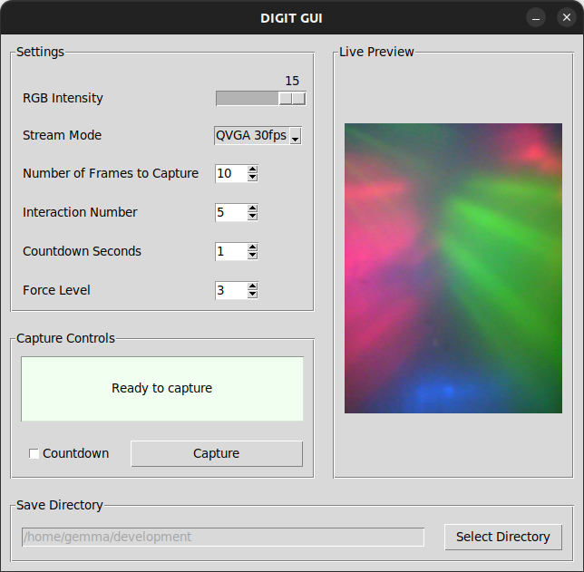

# DIGIT-FSR-GUI

## Overview

**DIGIT-FSR-GUI** is a custom extension of the original [DIGIT-GUI](https://github.com/gemixin/digit-gui), developed to support the collection of a bespoke dataset using a single [DIGIT](https://digit.ml/) tactile sensor with an attached Force Sensing Resistor ([FSR](https://wiki.seeedstudio.com/Grove-Round_Force_Sensor_FSR402/)). The FSR is affixed to the rear of the tactile sensor using adhesive and is connected to a Raspberry Pi Pico (via a [Grove Shield](https://wiki.seeedstudio.com/Grove-Starter-Kit-for-Raspberry-Pi-Pico/)). 

This version adds functionality specifically for force-conditioned tactile data collection:

- Establishes a USB serial connection for receiving streamed FSR measurements.
- Allows the user to select the target force level (1–3) for data capture.
- Filters captured tactile images according to the chosen force level.
- Logs FSR voltage readings alongside corresponding tactile images in a CSV file.



## Requirements

- **Operating System:** Linux only (DIGIT sensors are supported on Linux only)  
- **Tested Environment:** Ubuntu 22.04, Python 3.10.12 
- **Python Environment:** Use a regular Python virtual environment (Tkinter and Anaconda have compatibility issues on Linux)
- **Packages:** See `requirements.txt`

## Installation

1. **Clone the repository:**
   ```bash
   git clone https://github.com/gemixin/digit-fsr-gui.git
   cd digit-fsr-gui

2. **(Optional) Set up a virtual environment:** 
    ```bash
    python3 -m venv .venv
    source .venv/bin/activate

3. **Install required packages:**  
    ```bash
    python3 -m pip install -r requirements.txt

## Force

FSR voltage data is mapped to three discrete target force levels (corresponding to 'contact only', 'light press' and 'firm press' with the sensor). See [DIGIT Force Calibration](https://github.com/gemixin/digit_force_calibration) for the force level thresholds and Newton calibrations.


### Setup

1. Attach an FSR ([Grove Round Force Sensor](https://wiki.seeedstudio.com/Grove-Round_Force_Sensor_FSR402/)) to the rear of the tactile sensor using adhesive.

2. Connect the FSR to a Raspberry Pi Pico via a [Grove Shield](https://wiki.seeedstudio.com/Grove-Starter-Kit-for-Raspberry-Pi-Pico/) (A0).

3. Attach an LED Bar ([Grove LED Bar](https://wiki.seeedstudio.com/Grove-LED_Bar/)) to the Grove Shield (D16).

4. Connect the Pico to your computer via USB.

5. Upload the scripts from the `pico` folder to the Pico.

6. Close any programs accessing the Pico (e.g., Thonny) and restart it. The Pico will run `main.py` and begin streaming FSR data over USB. The bar light will indicate the current force level.


## Running the GUI

1. Connect your DIGIT sensor and Raspberry Pi Pico via USB.

2. Modify the serial connection port if required in `serial_controller.py`. The default is `/dev/ttyACM0`.

3. Run the GUI script:
    ```bash
    python3 digit_gui.py

## Usage and Known Issues

Please see original repo ([DIGIT-GUI](https://github.com/gemixin/digit-gui)) README.

## Citation

If you use DIGIT or this repo in your research, please cite:

**DIGIT: A Novel Design for a Low-Cost Compact High-Resolution Tactile Sensor with Application to In-Hand Manipulation**  
Mike Lambeta, Po-Wei Chou, Stephen Tian, Brian Yang, Benjamin Maloon, Victoria Rose Most, Dave Stroud, Raymond Santos, Ahmad Byagowi, Gregg Kammerer, Dinesh Jayaraman, Roberto Calandra  
_IEEE Robotics and Automation Letters (RA-L), vol. 5, no. 3, pp. 3838–3845, 2020_  
[https://doi.org/10.1109/LRA.2020.2977257](https://doi.org/10.1109/LRA.2020.2977257)